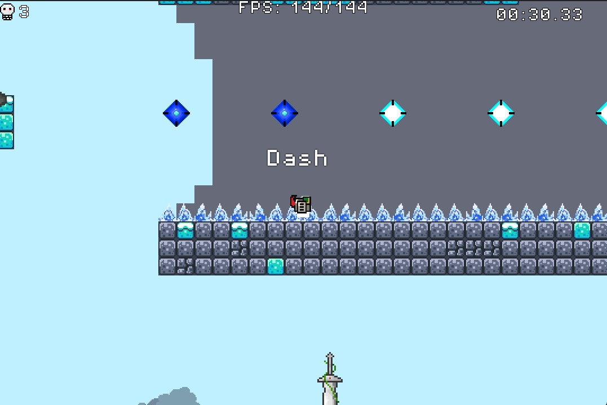

# PrecisionPlatformer
## Weird

```
Instruction
Press A, D to move left and right.
Press Spacebar to jump.
Press Shift to dash.
Press Esc to open pause menu in game.

[Itch.io](https://tdbbbfps.itch.io/)
```

**Under deveplopment**
*Under deveplopment*
~~Under deveplopment~~

> 1
> > One

> > Two

> 2
> > One

[![Level3 Testrun]](https://www.youtube.com/watch?v=QmkTWnSwevY)



```gdscript
extends CharacterBody2D
class_name Player

@export var speed : float = 175.0
@export var accel : float = 20.0
@export var friction : float = 25.0

var gravity = ProjectSettings.get_setting("physics/2d/default_gravity")
@onready var anisprite = $AnimatedSprite2D
@onready var fsm = $FSM
@onready var collision : CollisionShape2D = $CollisionShape2D
@onready var camera: Camera2D = $Camera

static var player_deaths : int = 0

func _physics_process(delta):
	apply_gravity(delta)
	if (velocity == Vector2.ZERO and fsm.current_state.can_transition):
		fsm.change_state("idle")
	climb()
	handle_jump()
	run()
	sprite_flip()
	move_and_slide()
	dash_reset()

##### Handling Movement #####
func apply_gravity(delta : float):
	if (not is_on_floor() and not is_climbing):
		velocity.y += gravity * delta

func run():
	var dir = Input.get_axis("Left", "Right")
	if (dir):
		velocity.x = move_toward(velocity.x, dir * (speed + dash_velocity), (accel + dash_velocity * 0.1))
	else:
		if (is_on_floor()):
			velocity.x = move_toward(velocity.x, 0, friction)
		else:
			velocity.x = move_toward(velocity.x, 0, accel)
	if (velocity.x != 0 and fsm.current_state.can_transition):
		fsm.change_state("run")
		
		
##FIXME While pressing both right and left key will make sprite keep fliping.
func sprite_flip():
	if (Input.is_action_pressed("Right") and anisprite.flip_h == true):
		anisprite.flip_h = false
	elif (Input.is_action_pressed("Left") and anisprite.flip_h == false):
		anisprite.flip_h = true
	
func _input(event):
	if (Input.is_action_just_pressed("Jump")):
		jump()
	if (Input.is_action_just_released("Jump") and velocity.y < 0):
		velocity.y *= 0.5
	if (Input.is_action_just_pressed("Dash")):
		dash()
	if (Input.is_action_just_pressed("Down")):
		position.y += 1
		
@onready var coyote_jump_timer: Timer = $CoyoteJumpTimer
var can_jump : bool = false
# Handle jump on the ground, in these scripts, player can only jump while is on the ground.
func handle_jump():
	# Player is able to jump while is on floor.
	if (is_on_floor() and not can_jump):
		can_jump = true
	##FIXME Fix this to make it able to touch gem to jump again
	# If the player leaves the floor, start a short timer. Once the timer runs out, set 'can_jump' to false.
	elif (not is_on_floor() and can_jump and coyote_jump_timer.is_stopped()):
		coyote_jump_timer.start()

func _on_coyote_jump_timer_timeout() -> void:
	can_jump = false
	
@export var jump_velocity : float = -300.0
func jump():
	if (can_jump):
		fsm.change_state("jump")
		can_jump = false
		velocity.y = jump_velocity
	# Wall bounce
	elif (not is_on_floor() and is_climbing):
		fsm.change_state("jump")
		
		velocity = Vector2.ZERO
		velocity.y = jump_velocity
		var wall_bounce = get_tree().create_tween()
		var temp = speed
		speed = -speed * 5
		wall_bounce.tween_property(self, "speed", temp, 0.05)

@export var dash_speed : float = 750.0
var dash_velocity : float = 0.0
var is_invincible : bool = false
var can_dash : bool = true

func dash():
	if (can_dash):
		can_dash = false
		is_invincible = true
		
		fsm.change_state("dash")
		dash_velocity = dash_speed
		var dash_tween = get_tree().create_tween()
		
		dash_tween.tween_property(self, "dash_velocity", 0, 0.25)
		ghosteffect_timer.start()
		await dash_tween.finished
		
		is_invincible = false
	
func dash_reset():
	if (is_on_floor() and not can_dash):
		can_dash = true
	elif (is_on_wall_only() and not can_dash):
		can_dash = true


##TODO make player can climb up while pressing up key
var is_climbing : bool = false
# 如果玩家在地板上且靠在牆上，不會觸發攀爬，但是當玩家按下跳躍鍵離開地面就會立刻觸發，導致跳躍可能會
# 使玩家直接飛起來
func climb():
	var input = Input.get_axis("Left", "Right")
	if (is_on_wall_only() and not is_on_floor()):
		if (not anisprite.flip_h and input > 0):
			if (not is_climbing):
				is_climbing = true
				velocity.y = 0
				fsm.change_state("climb")
			velocity.y += 1.0
		elif (anisprite.flip_h and input < 0):
			if (not is_climbing):
				is_climbing = true
				velocity.y = 0
				fsm.change_state("climb")
			velocity.y += 1.0
		else:
			is_climbing = false
	elif (not is_on_wall() and is_climbing):
		is_climbing = false
	#climb_up()
	#climb_down()		
		
func climb_up():
	if (is_climbing and Input.is_action_pressed("Up")):
		velocity.y -= 5.0
		
func climb_down():
	if (is_climbing and Input.is_action_pressed("Up")):
		velocity.y += 5.0
		
func frame_freeze(time_scale, duration):
	Engine.time_scale = time_scale
	await get_tree().create_timer(duration * time_scale).timeout
	Engine.time_scale = 1.0

@onready var ghosteffect_timer: Timer = $GhosteffectTimer

func _on_ghosteffect_timer_timeout() -> void:
	ghost_effect()
	# 如果殘影特效時間小於0.25則重複觸發 反之則停止並清除計數
	if (ghost_time < 0.25):
		ghosteffect_timer.start()
	elif (ghost_time >= 0.25):
		ghost_time = 0.0

@export var ghost_vfx : PackedScene ##FIXME
var ghost_time : float = 0.0
func ghost_effect():
	var new_ghost = ghost_vfx.instantiate()
	new_ghost.global_position = global_position
	new_ghost.flip_h = anisprite.flip_h
	new_ghost.frame = anisprite.frame
	get_tree().current_scene.add_child(new_ghost)
	ghost_time += ghosteffect_timer.wait_time

@onready var scene_transition: Control = $SceneTransition
@export var spawn_point : Vector2 = Vector2(24, -40)
func die():
	velocity = Vector2.ZERO
	player_deaths += 1
	%DeathsCounter.set_text(player_deaths)
	fsm.change_state("die")
	camera.shake(2.2, Vector2(randf_range(-16, 16), randf_range(-16, 16)))
	frame_freeze(0.5, 1.5)
	set_physics_process(false)
	scene_transition.Shrink()
	collision.disabled = true
	
	await scene_transition.aniplayer.animation_finished
	#Spwan in spawn point
	position = spawn_point
	collision.disabled = false
	scene_transition.Extend()
	set_physics_process(true)
	
func _on_hitbox_body_entered(body: Node2D) -> void:
	if (body.is_in_group("Trap")):
		die()
```
